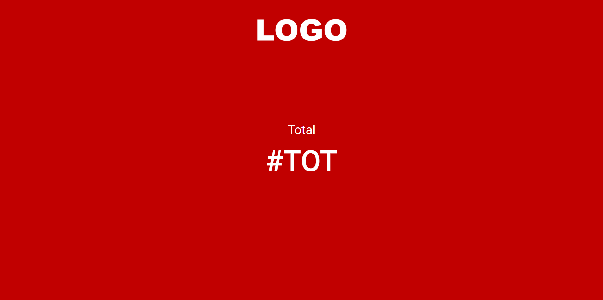
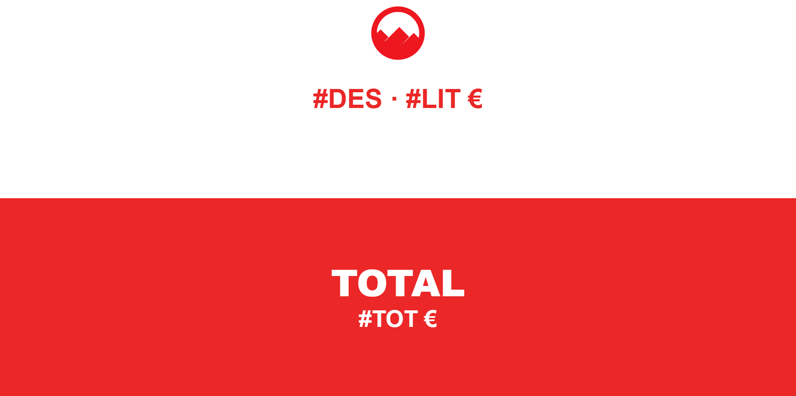
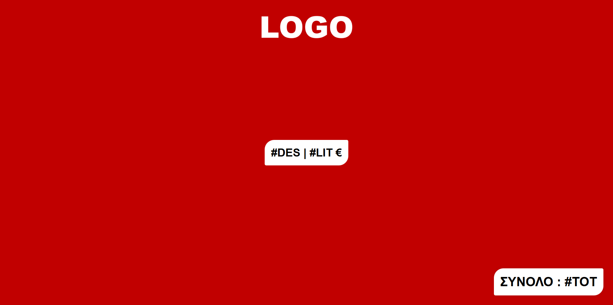

# SBZ Systems – Θέματα Οθονών Πελατών (EMDI)

Αυτό το repository περιέχει έτοιμα **θέματα οθονών πελατών** για το πρόγραμμα **SBZ Systems (EMDI)**.  
Κάθε θέμα είναι ένα αρχείο `cashier.htm` που μπορεί να χρησιμοποιηθεί άμεσα στο λογισμικό.

## Τι είναι η Οθόνη Πελάτη στην EMDI

Η *Οθόνη Πελάτη* είναι το δεύτερο monitor που βλέπει ο πελάτης κατά τη διάρκεια της συναλλαγής.  
Σε αυτήν προβάλλονται πληροφορίες όπως:

- Περιγραφή προϊόντος (#DES)  
- Τιμή μονάδας (#LIT €)  
- Συνολικό ποσό (#TOT)  

Με αυτόν τον τρόπο ο πελάτης έχει διαφάνεια και άμεση ενημέρωση για την αγορά του.

Περισσότερα για την παραμετροποίηση της οθόνης πελάτη θα βρείτε στη σελίδα υποστήριξης της SBZ:  
[Οθόνη Πελάτη στην EMDI](https://www.sbzsystems.com/el/programmata-efarmoges/emdi-emporiki-diaxeirisi/ypostirixi-emdi-commercial-management/rythmiseis/parametropoiisi-othonis-pelati-tis-emdi/)

## Οδηγίες Χρήσης

1. Επιλέξτε το θέμα που θέλετε (π.χ. `cashier.htm`).
2. Αντιγράψτε το αρχείο στο φάκελο εγκατάστασης του προγράμματος:  

---

## Παράδειγμα Θεμάτων

  <table>
    <tr>
      <td align="center">
         
        Κλασικό κόκκινο θέμα.
      </td>
      <td align="center">
         
        Μινιμαλιστικό λευκό θέμα με καθαρή παρουσίαση.
      </td>
      <td align="center">
         
        Θέμα με έντονη αντίθεση για μεγαλύτερη προβολή.
      </td>
    </tr>
  </table>

